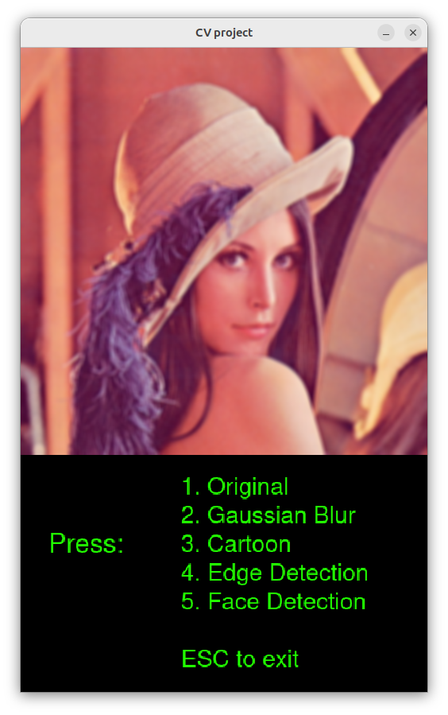
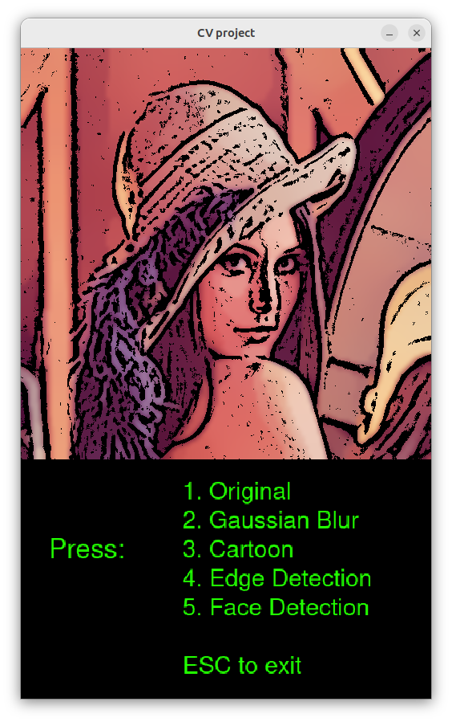
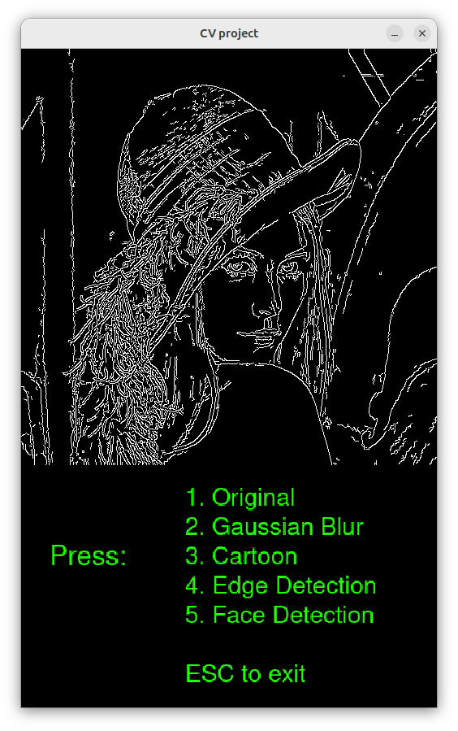
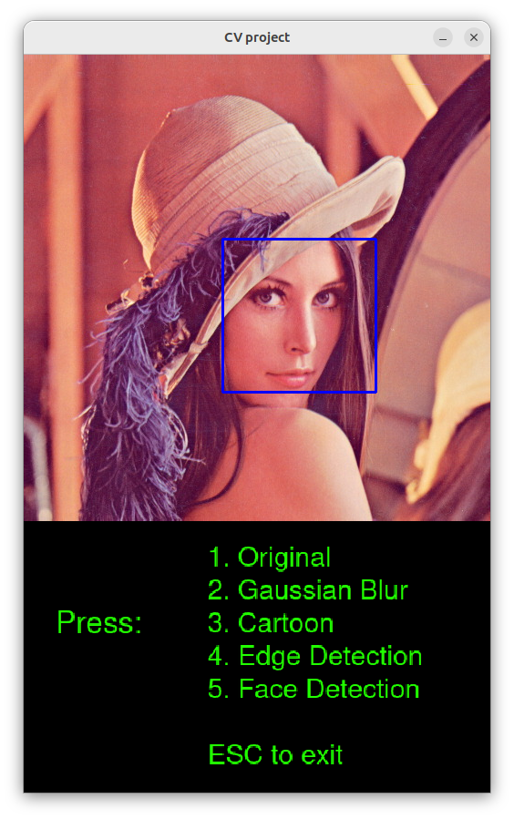

# OpenCV App

### Objective

This project was created to learn how to install and use OpenCV in C++. 

When executed it shows the original image and by pressing numbers 1 to 5 you can change the type of image processing technique applied which are:
* 1: Original image
* 2: Gaussian blur
* 3: Cartoonization 
* 4: Edge detection
* 5: Face Detection

### Results
<table>
  <tr>
    <td><b>Original</b> </td>
    <td><b>Gaussian Blur</b> </td>
    <td><b>Cartoon</b> </td>
    <td><b>Edge Detection</b> </td>
    <td><b>Face Detection></b> </td>
    
  </tr>
  <tr>
    <td></td>
    <td></td>
    <td></td>
    <td></td>
    <td></td>
    
  </tr>
</table>

### References

To install OpenCV I used this amazing tutorial: https://www.geeksforgeeks.org/how-to-install-opencv-in-c-on-linux/

The lena.jpg is one of the sample images from OpenCV.

I downloaded the haarcascade_frontalface_default.xml from https://github.com/opencv/opencv/blob/4.x/data/haarcascades/haarcascade_frontalface_default.xml 

For the cartoonization algorithm I adapted this python code: https://www.instagram.com/p/CErJrqZAD7Y/?igsh=MXJzdTh3YWQwZXcyZQ==

